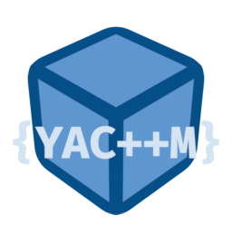

<h1 align="center">YACPPM</h1>
<h4 align="center"><i>Yet Another C++ Manager</i></h4>

> [!WARNING]
> This project is a work-in-progress (WIP).\
> Expect breaking changes, missing features, and rough edges.\
> Not recommended for production use.

<p align="center">
  <picture>
    
  </picture>
</p>

## Project Description

YACPPM (Yet Another C++ Manager) is an experimental simple C++ project and package manager,
Inspired by [Cabin](https://github.com/cabinpkg/cabin) and Cargo.

## Why
I'm making it mainly to experiment with automating build setup and also to simplify the build process for my projects hopefully ^^

## Current goals
- [x] Basic project scaffolding (`new`, `add`, `build`, `run`)
- [x] Support for header-only and CMake-based dependencies
- [x] Local caching of dependencies
- [x] Self-host YACPPM
- [ ] project template system (partial)
- [ ] build Release/Debug options (partial)
- [ ] Cross-compilation support (partial)
- [ ] Add more build system compatibility
- [ ] Finish command impl
- [ ] Add auto lib type check
- [ ] Make all options useable through cli


## Current Commands

### `yacppm new <project_name> [options]`
Creates a new C++ project (executables by default).

| Option       | Description                        | Example                          |
|--------------|------------------------------------|----------------------------------|
| `-template=` | Use a named project template       | `yacppm new game -template=raylib` |

---

### `yacppm add <type> <repo> [version]`
Adds a dependency to your project.

| Type     | Description                     |
|----------|---------------------------------|
| `-h`     | Header-only library             |
| `-c`     | CMake-based library             |
| `-llib`     | Local library (path on disk)    |

### `yacppm build [Release|Debug] [target] [arch]`
Generates a temporary CMakeLists.txt and builds the project.


### `yacppm run [Release|Debug]`
Same as build but once build finished run if the project is executable

### `yacppm remove <repo|name>` (not implemented yet)
Remove a dependency from your project.

### `yacppm set <option>`
| option   | Description                     |
|----------|---------------------------------|
| `-cpp`     | Header-only library           |

### Example
```bash
yacppm new my_project
cd my_project
yacppm add -h https://github.com/user/header_only_repo v1.0.0
yacppm add -c https://github.com/user/cmake_repo (will default to master branch)
yacppm build or yacppm run
```
## Cross Platform Build
Currently, YACPPM can build:
| From -> To     |                      |
|----------|---------------------------------|
| `linux->linux`         | native             |
| `linux->windows`       | through mingw-w64  |
| `windows->windows`     | native             |


## Platform Support

Currently, YACPPM is developed and tested primarily on:

- **Linux** (main development OS)
- **Windows** (partialy tested through VM)

Support for:
- **macOS** – not tested yet, PRs welcome

## Third-Party
This project uses the following third-party libraries:

- [**libgit2**](https://github.com/libgit2/libgit2): Copyright (C) the libgit2 contributors

- [**toml++**](https://github.com/marzer/tomlplusplus): Copyright (c) Mark Gillard

- [**fmt**](https://github.com/fmtlib/fmt): Copyright (c) Victor Zverovich and {fmt} contributors

- [**barkeep**](https://github.com/oir/barkeep/): Copyright (c) Ozan İrsoy
